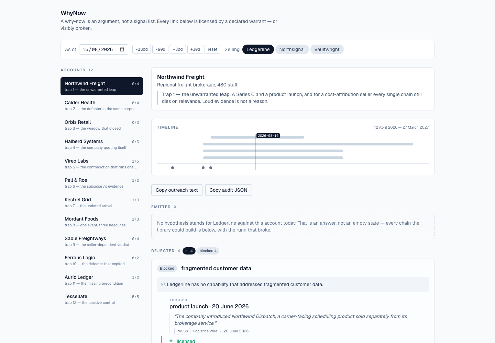
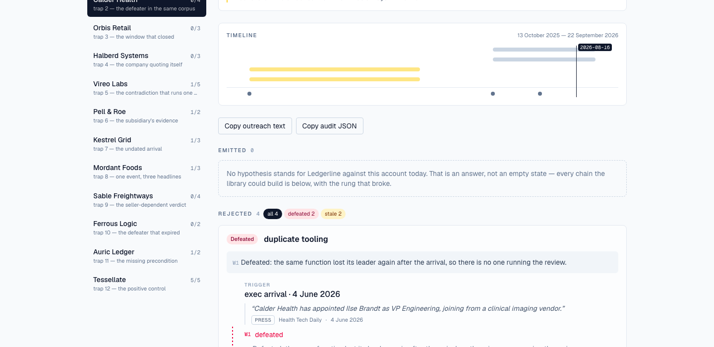
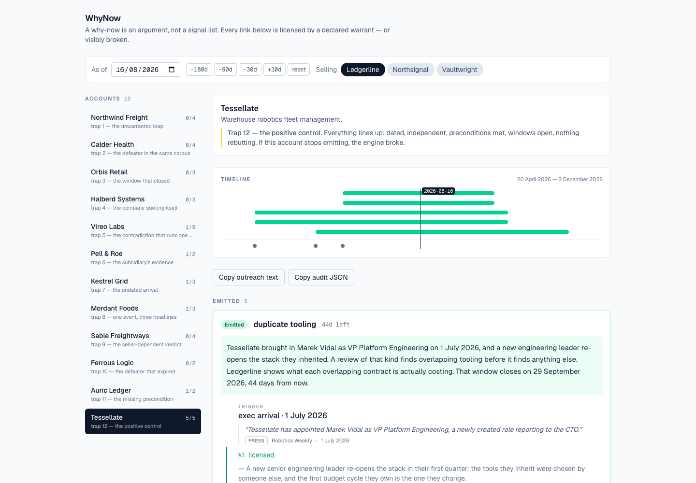
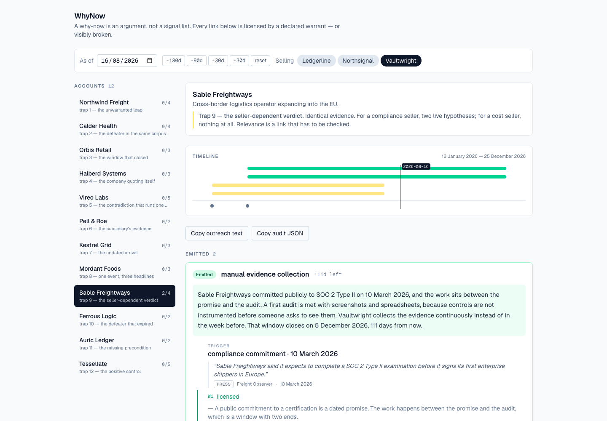

# WhyNow

Turns dated company evidence into a "why now?" hypothesis where every inferential step is licensed by a declared rule — or the chain visibly breaks at the step that failed.

[Live demo](https://why-now.vercel.app) · [Screenshots](#demo)

> The corpus in this repo is **authored and synthetic**. Every domain ends in `.example`, no real company is named or quoted, and the twelve accounts exist to carry twelve specific traps. To run the engine on real text, paste your own — see [Usage](#usage).

Day 007 of a 100-day building challenge.

## Why I Built This

A "why now" is the one sentence in a cold email that has to do real work. It is also the sentence every tool in this category fakes, because faking it is indistinguishable from doing it when you only read the output.

The default build is four lines of code: collect recent facts about a company, hand them to a model, ask for a compelling reason to reach out today. What comes back is fluent, specific, correctly dated, and often an argument that does not follow. That combination is worse than no output. A rep who sends a why-now that does not follow has told a VP of Engineering that they do not understand the business, using evidence that proves they looked.

Four failures live inside that default build.

**The inferential leap is invisible.** "They raised a Series B, so they need our SOC 2 automation." Read quickly, that scans. Read slowly, there is no link between the halves — a funding round is not an audit deadline, and nothing says the company committed to a certification. The leap happens in the gap between two sentences, which is exactly where nothing is rendered. Every tool in this space is a machine for producing well-cited non-sequiturs.

**Disconfirming evidence is never sought.** The pipeline is built to find reasons. Ask it for one and it returns one. The same corpus contains the job posting that was *filled last week* and the executive who *left again in August*, and nothing is looking. A system that can only accumulate support is not reasoning, it is advocacy.

**"Now" is asserted, not computed.** The output says *now* because the prompt said now. Nothing holds an opinion about how long a trigger stays actionable, so a round from fourteen months ago and one from last Tuesday arrive with the same urgency, in the same present tense.

**Relevance to the seller is assumed.** The hardest link — this company's new problem is a problem *my product solves* — is the one a model is least equipped to check and most willing to assert.

So the hypothesis is the output. **The licensing is the product.**

## What It Does

A why-now is modelled as an argument, not a signal list: a Toulmin chain of four typed links, each licensed by a **warrant** drawn from a declared library.

```
Trigger       Marek Vidal joined as VP Platform Engineering, 1 July 2026
   │  W1      a new engineering leader re-opens the stack they inherited        (window: 90 days)
Buyer state   stack under review
   │  W2      where observability vendors already changed once, that spend
   │          is large enough to have been noticed and has no single owner
Problem       unowned observability cost
   │  W3      Ledgerline — cost attribution addresses unowned observability cost
Relevance     cost attribution
   │  W4      1 July 2026 → 29 September 2026; 44 days left
Why now
```

1. Collapses evidence into triggers. Three outlets covering one funding round is **one** trigger, not three.
2. Enumerates every chain the warrant library can build for (account × seller × as-of date).
3. Licenses each link, or breaks it. Warrants carry **preconditions** (evidence that must be present) and **defeaters** (evidence that kills them).
4. Assigns exactly one of five verdicts: `emitted`, `blocked`, `defeated`, `stale`, `unsupported`.
5. Composes the sentence **from the warrants' own phrase templates** — no model writes prose, so the hypothesis cannot read better than the argument that was licensed.
6. Renders the rejected chains as first-class UI, open by default, each showing the rung that broke and the evidence that broke it — including the defeaters that were checked and *did not* fire.

There is no score. Day 005 already ships a scored board; a 0–100 "why-now score" here would be fake precision on a categorical judgment. A chain stands, or it is dead with a named reason.

## Demo

**The headline case.** Northwind Freight has a $60m Series C and a product launch — the loudest evidence in the corpus. For a cost-attribution seller, every chain dies, and three of them die on the *fourth* rung, valid the whole way up.



**The defeater in the same file.** Calder Health hired a VP Engineering in June. The engine reads on: she left again on 15 July. The chain is defeated and the killing quote is inline.



**A chain that stands.** Tessellate — dated, independent, preconditions met, windows open, nothing rebutting.



**Same evidence, different seller.** Sable Freightways emits nothing for the two technical sellers and two live hypotheses for the compliance seller. Nothing about the evidence changed; the relevance link stopped being licensed.



## How It Works

```
                    ┌─ server component ─► data/corpus.ts (Zod-validated at import)
Browser ────────────┤
                    ├─ lib/argument (pure) ─► the same function runs client- and server-side
                    │
                    ├─ POST /api/hypotheses         ─► Zod ─► lib/argument   (auditable JSON)
                    └─ POST /api/parse-observations ─► Zod ─► key check ─► rate limit
                                                         └─ lib/parse (one model call)
```

The load-bearing structural decision: **`lib/argument/` imports nothing non-relative** — not `next`, not `react`, not `zod`, not `@google/genai`. A test scans every engine file for bare import specifiers, with no allowlist.

That is not stylistic. A module that cannot import a model client cannot invent a warrant, so every link in every emitted chain came from the declared library that was passed in as an argument. There is no code path from model output to a rendered hypothesis that skips licensing, and `buildHypotheses` is the only function that assembles one.

### Warrants are data

```ts
{
  id: "w1-eng-leader-reopens-stack",
  link: "W1", from: "exec_arrival", to: "stack_under_review",
  text: "A new senior engineering leader re-opens the stack in their first quarter…",
  preconditions: [{ scope: "trigger", test: { attribute: "seniority", op: "in", value: ["vp", "c_level"] }, … }],
  requiresGrade: ["primary", "press"],
  windowDays: 90,
  defeaters: [{ id: "d-eng-leader-left-again", kind: "exec_departure", match: ["function"], … }],
}
```

Adding an inferential rule means adding a record. There is no `if (trigger.kind === …)` inside the engine.

### Defeaters have two halves, and both matter

A defeater fires only when it **postdates the trigger** *and* is **still inside its own `validForDays`**. A hiring freeze announced before the surge is not a rebuttal of the surge — it is the thing the surge reversed. A certification achieved 400 days ago does not close the audit cycle now due. Drop either half and a defeater is just a keyword blocklist; trap 10 exists to catch exactly that regression.

### Applicability is not the same as blocking

A warrant's trigger-scope preconditions say *which triggers it is about*. The finance-hire warrant is not about an engineering hire, and reporting that as a rejected chain would fill the rejected pane with arguments nobody was making. Those are skipped before enumeration. Corpus-scope preconditions are different: the warrant *is* about this trigger and the evidence it needs is absent. That is a real rejection, and it is what trap 11 turns on.

## Architecture

| Path | Role |
|---|---|
| `lib/argument/` | The engine. Pure, relative imports only, test-enforced. `buildHypotheses` is the sole entry point. |
| `data/warrants.ts` | 12 W1 warrants, 12 W2 warrants, their preconditions, windows and defeaters. |
| `data/sellers.ts` | Three sellers, four capabilities each. W3 is derived from these. |
| `data/corpus.ts` | 12 accounts, 32 observations, Zod-validated at import. A malformed corpus is a build failure. |
| `lib/parse/` | The one model call, its schemas, the rate limiter. |
| `lib/export/` | Outreach text and audit JSON. |
| `app/` | The console. The engine ships to the browser so the as-of control has no round trip. |
| `scripts/sweep.mts` | The invariant sweep. |

The engine runs in both places on purpose, and `equivalence.test.ts` asserts the browser and the route produce byte-identical JSON across the cross-product. Two code paths computing verdicts differently is the failure that test exists to catch.

## Key Decisions & Tradeoffs

- **Decision:** Model argument *validity*, not signal detection or citation grounding.
  **Why:** Day 005 (`signal-scout`) ranks accounts by timeliness and Day 006 (`account-brief`) resolves citations to character spans. Rebuilding either would have spent the day re-deciding solved problems.
  **Tradeoff:** Grounding here is weaker — an excerpt and a source, not a resolved character span.

- **Decision:** No numeric score, anywhere.
  **Why:** A score invites sorting and summing, which is how a categorical judgment turns back into a leaderboard.
  **Tradeoff:** No single number to sort a list by; this tool is for one account at a time.

- **Decision:** Defeaters are declared on warrants, never generated.
  **Why:** A model asked "what would kill this?" invents plausible conditions and never finds them present. Declared defeaters are testable, and "defeater fired" becomes an assertable property.
  **Tradeoff:** The system only finds rebuttals someone thought to declare.

- **Decision:** Prose comes from warrant templates; the model only parses.
  **Why:** The sentence is then a pure function of the licensed structure. You cannot polish your way past a missing rung, because there is no polishing step.
  **Tradeoff:** The prose is more uniform than a model would produce.

- **Decision:** Two problem classes are solved by no seller.
  **Why:** It makes `blocked` reachable on the fourth rung of a chain valid for three — the exact shape of the failure this project exists to kill.
  **Tradeoff:** The seller library looks deliberately incomplete, because it is.

- **Decision:** Synthetic corpus, no live fetching.
  **Why:** A one-day build that fetches arbitrary URLs inherits SSRF handling it will not do properly, and a demo whose output depends on someone else's website breaks silently.
  **Tradeoff:** Nobody can point at a real company and check the verdict without pasting text.

## Getting Started

### Prerequisites

Node.js 20+ and npm.

### Installation

```bash
git clone https://github.com/akshatiwarix/why-now.git
cd why-now
npm install
npm run dev
```

### Configuration

None required. The twelve accounts, three sellers, every verdict and both exports work with no environment variable set.

`GEMINI_API_KEY` is optional and enables only the paste panel. Without it the panel returns a 501 explaining as much, and nothing else changes.

```bash
cp .env.example .env.local   # then add GEMINI_API_KEY=… if you want the paste panel
```

### Run Locally

```bash
npm run dev         # dev server
npm test            # 106 tests
npm run sweep       # the invariant sweep — 160,124 assertions, no network
npm run typecheck
npm run lint
npm run build
```

## Usage

**In the console:** pick an account, pick a seller, move the as-of date. Expand any rung to see the warrant, the preconditions that were checked, and the defeaters that were checked and did not fire. The rejected pane is open by default — that is the demonstration.

**As an API:**

```bash
curl -s -X POST https://why-now.vercel.app/api/hypotheses \
  -H 'content-type: application/json' \
  -d '{"companyId":"calder-health","sellerId":"ledgerline","asOf":"2026-08-16"}' | jq '.counts'
# { "emitted": 0, "blocked": 0, "defeated": 2, "stale": 2, "unsupported": 0 }
```

Move the date back before the departure and the same call returns emitted chains. No key needed.

**On your own text:** open the paste panel, name the company, paste press coverage or job postings. The model turns it into typed, dated, quoted observations; every quote is checked against the text you pasted, and anything the model composed rather than copied is dropped with a reason. Then the same engine runs, on the same rules.

## Validation / Testing

- **106 tests.** Unit coverage for date arithmetic across month, year and leap boundaries; attribute tests; precondition checking; defeater timing (fires, predates, mismatched, expired); trigger collapse; each of the five verdicts.
- **Twelve trap tests**, one per account, asserting the engineered failure produces the intended verdict. These are the twelve ways the naive build is wrong.
- **Purity test.** Scans `lib/argument/**` for bare import specifiers. No allowlist.
- **Equivalence test.** The browser path and the API route return byte-identical JSON.
- **The invariant sweep** (`npm run sweep`): 12 accounts × 3 sellers × 365 as-of dates, 13,140 engine runs, **160,124 assertions**, ~0.5s, no network.

```
  accounts        12
  sellers         3
  as-of dates     365 (2025-10-01 → 2026-09-30)
  engine runs     13,140
  assertions      160,124
  monotonicity    3,774 injected defeaters, every emitted chain
  determinism     13,140 repeat runs compared, byte for byte
  all invariants hold
```

**Monotonicity** is the headline: for every emitted chain, the sweep synthesises the observation that chain's own warrant declares would kill it, injects it, and asserts the chain is no longer emitted. That is a property a prompt-based build cannot state, let alone test — there is no sense in which adding a sentence to a prompt is guaranteed to remove a conclusion.

The sweep also earned its keep during the build: it caught a defeater firing on a report published the day *after* the as-of date. Visibility gated on `eventDate` but not `observedAt`, so the engine was rebutting a hypothesis with tomorrow's article. Fixed in `lib/argument/match.ts`, with a regression test.

## Limitations

- **The corpus is invented.** It is engineered to be hard in twelve specific ways, which is not the same as being representative.
- **The warrant library is small** — 24 warrants over 10 trigger classes. Real coverage of B2B triggers is an order of magnitude larger, and the system only rejects arguments it has rules about.
- **Only declared defeaters are found.** A rebuttal nobody thought to declare passes unnoticed.
- **Chains are single-trigger.** Two triggers that only license a conclusion jointly cannot be expressed.
- **No character-span citations.** An excerpt and a source, not a resolved span. That is Day 006's problem, solved there.
- **The rate limiter is process-local**, so a scaled-out deployment gets one window per instance.
- **The corpus dates are fixed** around a `DEFAULT_AS_OF` of 2026-08-16. It does not age with the calendar; move the as-of control instead.
- **No demo GIF.** The four screenshots above are from the live deployment; the as-of animation is not recorded.
- **Nothing persists.** No accounts, no saved hypotheses, no auth.

## What I'd Build Next

- A warrant editor, so the rules can be argued with in the UI rather than in a file.
- **Backing** for warrants — a citation for *why each rule is believed*, which is the Toulmin element this build skips.
- Qualifiers ("presumably", "very likely") as a declared strength on a warrant, still not a score.
- Chains that compose across two triggers.
- A second model call that *proposes* candidate warrants for human review, never auto-admitted.
- User-editable seller profiles.

## License

MIT. See [LICENSE](LICENSE).
